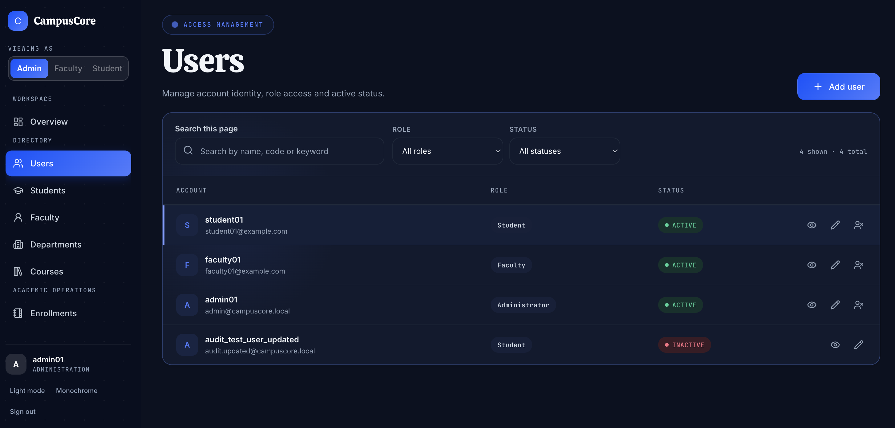

# CampusCore

CampusCore is a university operations application that brings campus accounts and academic records into one role-based workspace. Administrators manage the directory and academic records, while linked faculty and student accounts can access the information currently supported by the API.

## Demo

Live demo: <https://campus-core-three.vercel.app>

The public frontend is deployed to Vercel, the Spring Boot API runs as a Docker service on Render, and the database is a Layerbase MariaDB instance. The demo environment is a separate deployment from local development and uses synthetic demonstration identities and academic records rather than real personal data, as noted under [Screenshots](#screenshots).

To run the same stack on your own machine instead, use Docker Compose (see [Local setup](#local-setup)).

## Screenshots

These browser screenshots use synthetic demo identities and records. They are demonstration images, not production user data.

| View | Screenshot |
| --- | --- |
| Login |  |
| Admin dashboard |  |
| Course catalog |  |
| Student workspace |  |
| Faculty workspace |  |
| Access management |  |

Do not capture real personal records, credentials, or tokens.

## Features and roles

- **ADMIN:** user and student directory management, faculty creation, departments and courses, enrollments, assessments, marks, attendance, grading policies, GPA lookup, and read-only audit logs. Available operations follow the existing API methods.
- **FACULTY:** authenticated faculty profile, student directory, course catalog, and department catalog. The current data model does not define faculty-course assignments, so assigned teaching operations are not presented.
- **STUDENT:** authenticated self profile, personal dashboard, own enrollment list, own enrollment GPA lookup, and the course catalog.
- Responsive role workspaces with form validation, search/filtering on loaded lists, detail dialogs, and loading, empty, error, and mutation feedback states.

## Legal pages

Two public pages render without signing in:

- **Privacy Policy** — `/privacy`
- **Terms & Conditions** — `/terms`

Both are reachable from the sign-in card, the authenticated sidebar, and the public footer. They are static React routes served through the same SPA rewrite as the rest of the application, so they resolve directly by URL without a session.

## Architecture

```text
Browser
  │ static React bundle from Vercel
  │ SPA rewrite sends all routes to index.html
  │ JSON over HTTPS + Bearer JWT
  ▼
Spring Boot REST controllers and services on Render (Docker)
  │ Spring Security and JWT checks
  ▼
Spring Data JPA ───────────────► MariaDB on Layerbase
```

The browser keeps the JWT in memory and sends it in the `Authorization` header. The Spring Boot API validates authentication and roles, applies ownership checks for student self-service, and uses JPA repositories to access MariaDB over the MySQL protocol. Logout clears the client session; a page reload requires signing in again because there is no refresh-token endpoint.

In production the three tiers are hosted separately: Vercel builds and serves the frontend, Render runs the backend as a single Docker service, and Layerbase provides the managed MariaDB instance. CORS is configured on the backend for the deployed frontend origin.

## Technology stack

- **Frontend:** React 19, TypeScript, Vite, React Router, TanStack React Query, React Hook Form, Zod, Radix UI, Lucide, Sonner.
- **Backend:** Java 25, Spring Boot 4.1.1, Spring MVC, Spring Security, Spring Data JPA, Bean Validation, JJWT, BCrypt.
- **Database:** MySQL-compatible schema; `backend/database/schema.sql` defines the tables and relationships. Local development and CI run MySQL, and production runs MariaDB on Layerbase through the MySQL connector.
- **CI:** GitHub Actions runs Maven verification and frontend lint/build on pushes and pull requests.
- **Deployment:** the frontend is deployed to Vercel, the backend runs on Render as a Docker service described by `render.yaml`, and the database is a managed Layerbase MariaDB instance. `frontend/vercel.json` provides the SPA rewrite. Docker Compose remains available for local runs.

## Security

- Passwords are encoded with BCrypt; API responses omit password hashes.
- JWTs are held in browser memory only, never in browser storage.
- Spring Security enforces role rules; frontend route guards are for navigation only.
- Student profile and enrollment self endpoints resolve the profile through the authenticated username and user foreign key. Student-specific record and GPA paths enforce ownership in the backend.
- CORS origins are configurable with `CORS_ALLOWED_ORIGINS` (local default: `http://localhost:5173`).
- Keep local datasource credentials and JWT signing keys outside source control. `VITE_*` values are public browser configuration and must not contain secrets.

## Core modules and API

The versioned REST API is rooted at `/api/v1`. Modules include authentication (`/auth`), users, students, faculty, departments, courses, enrollments, assessments, marks, attendance sessions and records, grading policies/GPA, audit logs, and the student dashboard. The frontend uses these existing API routes; create operations that are query-parameter based follow their controller contracts.

Major collection endpoints support server-side pagination when both `page` and `size` query parameters are supplied. Page numbers are zero-based and page size is limited to 1–100. The response contains `content`, `page`, `size`, `totalElements`, and `totalPages`. Omitting both parameters preserves the legacy array response for backward compatibility. Departments remain a small unpaginated reference list, and `/enrollments/me` remains an authenticated user's array response. Detail, GPA, and dashboard endpoints are unchanged; not every endpoint is paginated.

## Database overview

The schema links users to student/faculty profiles, departments to courses, students and courses through enrollments, assessments and marks to course/enrollment records, and attendance records to sessions/enrollments. Audit logs record supported administrative actions. The schema file creates tables only; it does not provide demo records or credentials. Hibernate is configured to validate the schema rather than create or update it.

### Optional synthetic demo data

`backend/database/demo-data.sql` contains synthetic CampusCore records for a disposable demo database. Use it only after creating a fresh, isolated database and applying `backend/database/schema.sql`:

```sh
mysql -e 'CREATE DATABASE campuscore'
mysql campuscore < backend/database/schema.sql
mysql campuscore < backend/database/demo-data.sql
```

Run these commands only on a fresh, isolated MySQL instance because the schema selects the database named `campuscore`. Do not run the seed against an existing or production database. It creates synthetic application accounts with BCrypt password hashes; no demo password is published in this README. Keep demo and production databases separate.

## Local setup

### Docker Compose

Prerequisites: Docker with the Compose plugin. At the repository root:

```sh
cp .env.example .env
```

Replace the placeholder database passwords and set a randomly generated JWT signing secret of at least 32 bytes in `.env`, then start the stack:

```sh
docker compose up --build
```

The local frontend is available at `http://localhost:5173` and the API at `http://localhost:8080`. MySQL is not published to the host: the backend reaches it over the Compose network, so use `docker compose exec mysql mysql -ucampuscore -p"$DB_PASSWORD" campuscore` for database access. Compose initializes an empty named MySQL volume from the schema on first creation. It does not create application accounts. To discard this local database volume, use `docker compose down -v`; this deletes the Compose database data. A first run creates an empty database from the schema and, by design, no application accounts.

The `frontend` image compiles the application at build time and serves the static bundle from nginx, which is also the production behaviour; `VITE_API_BASE_URL` is passed to that build, so changing it requires `docker compose build frontend`. The `backend` image builds the jar with Maven, runs as an unprivileged user, and starts with the `production` Spring profile.

### Run services separately

1. Create a MySQL database and apply `backend/database/schema.sql` using your MySQL client.
2. Copy `backend/src/main/resources/application-example.properties` to the ignored `backend/src/main/resources/application.properties`; set local DB values and supply `JWT_SECRET` as an environment variable. Never commit the local properties file.
3. Start the backend from `backend/` with `./mvnw spring-boot:run`.
4. From `frontend/`, run `npm ci`, copy `.env.example` to `.env`, set `VITE_API_BASE_URL` if needed, and run `npm run dev`.

## Environment configuration

| Variable | Used by | Purpose |
| --- | --- | --- |
| `DB_URL` | Backend / Compose / deployment | JDBC URL for the MySQL-compatible database: MySQL locally, MariaDB in production |
| `DB_USERNAME`, `DB_PASSWORD` | Backend / Compose / deployment | Database account |
| `JWT_SECRET` | Backend / deployment | Private JWT signing secret (at least 32 bytes) |
| `JWT_EXPIRATION` | Backend | Token lifetime in milliseconds; defaults to 24 hours |
| `CORS_ALLOWED_ORIGINS` | Backend / deployment | Comma-separated allowed browser origins |
| `VITE_API_BASE_URL` | Frontend build | Public API root, e.g. `http://localhost:8080/api/v1`. Vite inlines it while building, so it is a Docker build argument and not a runtime variable. It must be a public URL, never a secret. |

Root `.env.example` contains placeholders for Compose only. `frontend/.env.example` contains the local API URL. Never use a real secret in either example file.

For a hosted deployment set `DB_URL`, `DB_USERNAME`, `DB_PASSWORD`, `JWT_SECRET` and `CORS_ALLOWED_ORIGINS` in the platform's secret store (Render, for example, uses the `sync: false` entries in `render.yaml`). The backend refuses to start when `JWT_SECRET` is missing or shorter than 32 bytes, and no credential is read from a committed file.

## Verification

From `backend/`:

```sh
./mvnw -o clean compile
./mvnw -o test
```

From `frontend/`:

```sh
npm ci
npm run lint
npm run build
```

GitHub Actions uses Java 25 and Node 24 and provisions a temporary MySQL service for backend tests. The frontend project does not currently include automated browser/E2E tests.

Production verification has been completed against the deployed stack. The Vercel frontend loads and boots without console errors, its SPA rewrite resolves application routes directly by URL, and it is configured to call the Render API at `https://campuscore-api-32qm.onrender.com/api/v1`, which serves the API over HTTPS and rejects invalid credentials correctly. The Render service is on a free plan, so the first request after an idle period can take around half a minute while the instance starts.

## Known limitations

- No faculty-course assignment relationship or faculty teaching operations.
- No demo account credentials are published in this README; access to the hosted demo requires credentials from the project operator.
- The frontend project does not include an automated browser/E2E test suite.
- JWT sessions are memory-only and require login after reload; no refresh-token endpoint exists.

## Roadmap

1. Extend server-side filtering to collection workflows where campus usage requires it.
2. Model faculty-course assignments and add ownership-scoped teaching workflows if the institution's requirements support them.
3. Add automated API/security and browser-level regression tests.
